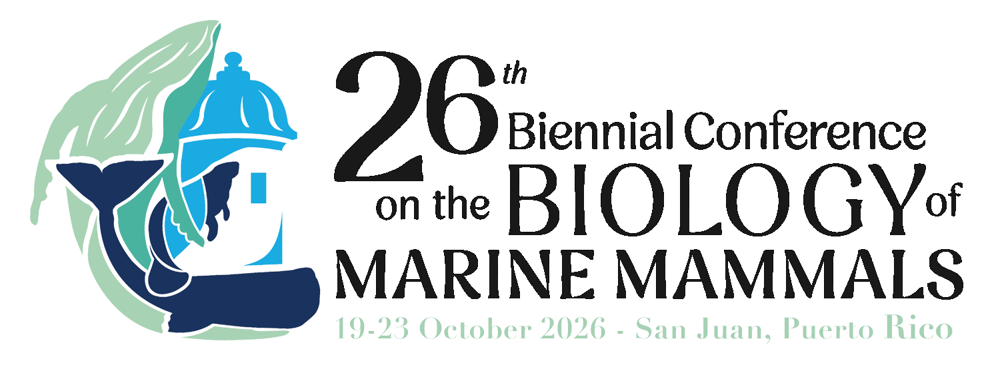
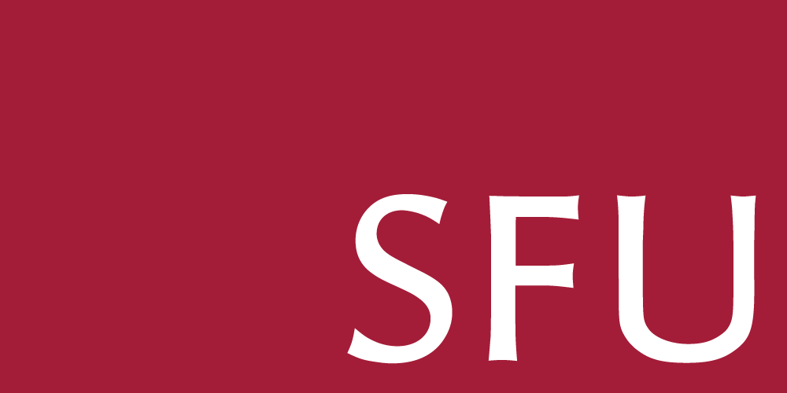

## **26th Biennial Conference on the Biology of Marine Mammals**

Centro de Convenciones Pedro Roselló Conzález

San Juan, Puerto Rico

17-18 October 2026 - Pre Conference Workshops

19-23 October 2026 - Conference 

Main Conference Website: <https://www.smmconference.org/>

As we get closer to the travel dates- we will send out information on the listserv about how to connect to your fellow NWSSMMers for travel info and to meet up during the conference!

## **2026 Annual NWSSMM Chapter Meeting**

This Spring the Annual Chapter Meeting will be held at **Simon Fraser University**, BC Canada!

While the details are still in the works (keep an eye out on the listserv), note that our previous meetings have generally been scheduled in early May.

In the past, the Annual Meeting has been a fun, low cost way to get connected to other students doing research on marine mammals in the Pacific Northwest! These student-led conferences are the bread and butter of our organization - not only do we connect with each other, it gives us a chance to explore the universities and regions that our colleagues do research. Take advantage of this opportunity to connect and explore!
